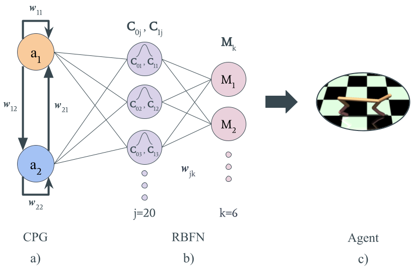

# neuro-evolutionary_cpg-rbfn

Neural Evolutionary Learning for legged locomotion based on CPG-RBFN framework.

Course project for the course ROB 537 Learning Based Control at Oregon State University in Fall 2023.

To train the model run the following command:

``` bash
python3 run_train.py
```

Our paper can be found [here](./media/paper.pdf).

Videos from our experiments can be found in this Google drive [folder](https://drive.google.com/drive/folders/1XkruLDGdvUqeXTAUOn0_rwLFGQ2sfx9v?usp=sharing).

The network overview is as follows:



In this network using our method, Neuroevolution Learning we learn the $C_{ij}$ RBF centers and $w_{jk}$ output weights.

Project by:

- [Ashutosh Gupta](https://github.com/Ashutosh781)
- [Manuel Agraz](https://github.com/Magraz)
- Ayan Robinson
